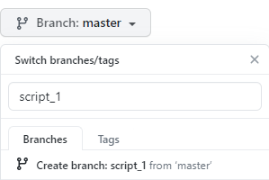
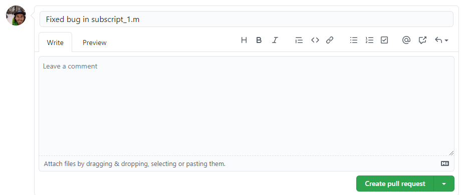

# Breakout Room #1
    
*The fruit of your labor and best shot at winning the Nobel Peach Prize*

## Background
You and your collaborators have made a recent discovery that will surely result in winning the prestigious
Nobel Peach Prize, awarded to the group of biomechanists with the best peach-related figure made entirely with 
code! Your team worked for months, submitted the figure to Nature, and just received reviewer comments. 
Your team will be able to quickly address these comments in parallel thanks to Git and GitHub!

The code used to generate your figure is comprised of an upper-level script (e.g. `ASB_Tutorial/main_script`), which 
calls five numbered subscripts (e.g. `ASB_Tutorial/subscripts/script_1`). The data required to generate your 
figure is stored as CSV files at `ASB_Tutorial/data/`. 

**If you need help remembering the git functions, refer to `ASB_Tutorial/git_cheatsheet.md`.**

## Objective
Work together to address the reviewer comment for each subscript and generate the revised figure 
by running `main_script`.

## 1. Organize
Your project leader has already invited you as collaborators on the remote repository on Github. If this hasn't 
happened yet, ask for help from the Tutorial Team.

### a. Assign Tasks
You will divide and conquer the reviewer comments. There is one comment for each of the five subscripts. Open a tab,
naviagte to your team's repository page, and select the `reviewer_comments.md` file. After reading, assign each team 
member a subscript to fix. If there are more subscripts than team members, assign multiple subscripts for some members. 

### b. Branch Out
Once subscripts are assigned, each team member should make their own branch of the repository on GitHub. Branching creates
isolated versions of the current state of the repository and allows team members to simultaneously make changes without 
affecting each other or the script stored in the remote (online) repository. **Name each branch after the respective 
subscript(s) that will be fixed.**

1. Navigate to the main page of your team's repository on GitHub (e.g. www.github.com/GROUP-LEADER-USERNAME/ASB_Tutorial)

2. Click the branch selector menu:    
    
3. Type in a descriptive name for your branch (like the name of subscript you're changing), then select **Create branch**:    
    
    
    If you can't find the "create branch" button, you might not have accepted the invitation to collaborate on the 
    repository. Check your email or ask for help from the Tutorial Team.
    
### c. Clone repository
If you're going to be changing code, you need a copy of it on your computer. This is initially done through a process
called "cloning", where you download a local copy of a remote repository. To do this, you will use Git Bash or Terminal,
depending on your operating system. *This tutorial will refer to Git Bash, but the functions are the same in Terminal.*
 
Repositories can be cloned into any folder, but for this tutorial you will be cloning into the `Desktop` folder.
Open Git Bash and navigate to the `Desktop` folder by using the `cd` (change directory) command:
```
$ cd Desktop
```
Now you can clone the remote repository from github.com to your `Desktop` folder. `URL` is the URL for the repository of
the group leader and will include their username. It should be like `https://github.com/GROUP-LEADER-USERNAME/ASB_Tutorial`.
```
$ git clone URL
```
You now have a copy of the repository located at `~/Desktop`. Go check it out! You'll see all the files that are 
present on the main page (master branch) of your group's repository on GitHub. In Git Bash, navigate into the repository
you just cloned:
```
$ cd ASB_Tutorial
```
Before making any changes to files, you need to "check out" the branch you created on GitHub. Remember that branches 
are isolated versions of a (local and/or remote) repository. Execute the following to switch branches:
```
$ git checkout BRANCH-NAME
```
Git should return a message explaining that you `"Switched to branch BRANCH-NAME"`. 
Now you're ready to address some very reasonable reviewer comments!

## 2. Making changes to files
### a. Debug subscript 
This isn't a tutorial on debugging, so the bugs are easy to fix and solutions are commented out at the bottom of each 
subscript. Open MATLAB (or a basic text editor) and fix the bug in your subscript. Save the debugged file (with the 
same filename).
### b. Commit changes
You made changes to files in the repository and want these changes to be tracked by Git. Git takes "snapshots" called 
"commits" of your repository files, but you have to tell it 
1) which files to include in the commit
2) when to make the commit (and include a message describing the changes in the commit)
3) update the remote repository on GitHub with your local changes. 

These three steps are performed in Git Bash and are outlined below.

#### 1. Tell Git that files have been changed and should be included in the commit. 
Git will compare the current state of the files to their previous state and identify any changes made. Files that have
been changed will be "staged". In the "snapshot" analogy, this step is like wrangling your family members right before 
taking the picture.
```
$ git add .
```
Use the `status` function to view the files Git has identified as undergoing some change (lines starting with `#>>>` 
represent an example returned message):
```
$ git status

1>>> On branch BRANCH-NAME 
2>>> Your branch is up to date with 'origin/BRANCH-NAME'.
3>>>
4>>> Changes to be commited:
5>>>   (use "git reset HEAD <file>..." to unstage)
6>>>       modified: script_1.m
```
This returned message tells you a few things:
1. The branch you're working on. (line 1)
2. Git found changes that are staged (the result of `git add .`; line 4)
3. How to remove a specific file from being staged (`git reset HEAD FILENAME`; line 5)
4. Names of the changed file(s) (line 6). 

#### 2. Tell Git when to make the commit
To continue using the "snapshot" analogy, you need to decide when to take the "snapshot". In this case, you fixed a bug 
and this represents a meaningful level of changes made to your script. To help organize commits, you need to add a message
that will be associated with the staged changes. For now, make it short and sweet. For more information on meaningful 
commit messages, read [this blog post](https://chris.beams.io/posts/git-commit/) later. Remember: Git will only commit the 
*staged* changes.
```
$ git commit -m "COMMIT MESSAGE GOES HERE IN QUOTATIONS"
```
#### 3. Update remote repository
So Git has taken a snapshot of your local repository and identified changes made. However, the remote repository stored on 
GitHub hasn't been updated. This is a cool feature of Git because you can make many changes (commits) without internet
access to GitHub because you have a local copy of the repository on your computer! Then, when it's convenient, you can 
send all your commits to the repository on GitHub. This process is called "pushing" commits.

To push commits to your remote repository on GitHub, run: 
```
$ git push 
```
Now if you got to the page for your branch on github, you'll see the changes you made locally! To view your branch:

1. Navigate to the main page of the repository on www.github.com

2. Click the branch selector menu and select your branch name from the dropdown menu:    


3. Click on the commit 7-digit identifier to view the changes made:    


GitHub will show the line-by-line changes made to the script as well as the commit message.

**Before moving on, make sure all team members have fixed their assigned scripts, staged/committed/pushed their changes, 
and viewed them on GitHub.**

## 3. Merging branches
At this point, each branch contains their respective fixed subscripts. However, `main_script.m` on GitHub still isn't functional 
because you haven't merged all these changes together. The way this is accomplished in GitHub is through a process called
"Pull Requests". Pull requests merge a given branch with the master branch, applying any changes made in the branch. 

### a. Open Pull Request
Each member will need to open a pull request for their branch. Navigate to the main repository page on GitHub and select
the **Pull requests** tab:    
    
and select the green "New pull request" button.

Set the "base" branch to `master` and the "compare" branch to your branch from the dropdown menu:    


GitHub will bring up information about your branch like the number of commits, files changed, and contributors. You will
also see the line-by-line changes and commit message from earlier. Select the green "Create pull request" button. Then 
GitHub will ask you to add more information about the branch you're trying to merge. Write an informative title and 
select the green "Create pull request" button to confirm your decision:    
    

Now, GitHub will compare the changed files in your branch to their original state in the master branch and try to implement
these changes. In some cases, there may be conflicts where multiple contributors have changed the same line of code. These
conflicts are typically resolved manually, but good project organization can generally avoid merge conflicts. **If GitHub 
finds conflicts with your pull request, ask for help from the Tutorial Team before merging the pull request.**

If there are no conflicts (there shouldn't be any), select the green "Merge pull request" button. This will update the master
branch to include the changes you made in your branch. **This process will need to be accomplished for each branch.**    
    

You can now delete the branch by selecting "Delete branch" because your bug is fixed! Making branches is easy in Git, 
so it's best practice to make one for each feature you'd like to add to a script.     


At this point, the changes have been merged in the master branch in the remote repository on GitHub, but not your local 
copy. Updating your local repository is easy. This process is called "Pulling". 

## 4. Pull changes from Remote Repository
In Git Bash, switch back to the `master` branch:
```
$ git checkout master
```
Then, tell git to check the remote repository for any changes that might have occurred and pull those changes over to your
local copy:
```
$ git pull
```
Now your local copy is up to date with the remote repository on GitHub. 

## Moment of Truth
Go ahead and run `main_script.m` on your own. If all the bugs are fixed and changes from each branch were merged into
`master`, `main_script.m` should run successfully and produce your figure. Hopefully it's good enough to win the Nobel 
Peach Prize!


 


